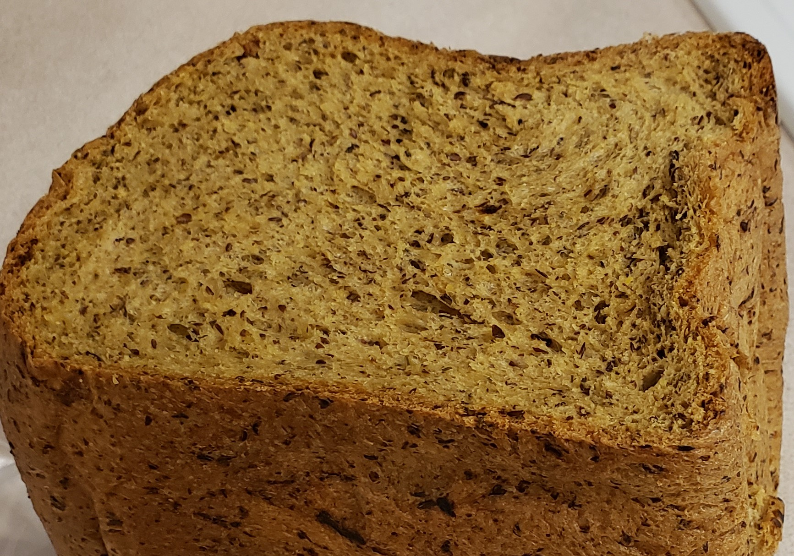

<h2> Low Carb Herb bread for a bread machine </h2>

<h6>Typical 2-pound loaf bread machine is used.</h6>

**List of ingredients:**
 
- [ ] 1/4 quarter cup of raw onion
- [ ] 2 tbsp butter
- [ ] One cup slightly warm water. ~80 degrees
- [ ] 2 eggs lightly beaten.
- [ ] 1/2 cup of oat fiber.
- [ ] 2/3 cup of flaxseed meal.
- [ ] 1 and 1/4 one quarter cups of vital wheat gluten.
- [ ] One tsp. of salt.
- [ ] 2 tablespoons of keto friendly sweetener (Typically monk fruit)
- [ ] One teaspoon of honey.
- [ ] Half a teaspoon of as xanthan gum.
- [ ] 2 tablespoons of butter no salt.
- [ ] One tsp. of dried dill
- [ ] One tsp. of dried basil
- [ ] One tsp. of dried rosemary
- [ ] One tbsp. of active dry yeast
 
 
 
* **Directions:**
1. Start by adding butter and onions to sauté pan. Sauté on medium heat till slightly brown or to taste .
1. While the onions are sautéing get you bread pan from the bread machine. Add the water, eggs, oat fiber, flaxseed, vital wheat gluten, salt, sweetener, honey, xanthan gum, salt, and spices to the bread pan. Leave a little of the flour in the middle exposed so you can make a hole for the yeast(protection).
1. Once the onion and butter is done cooking and cooled(very import) add it to the side of the PAN. Then add yeast.
1. Once this is all done put the bread pan back into the bread machine. Set the machine to standard loaf and the lightest setting.
* Optional: Some might prefer the final cooking in a ceramic pan 400 degrees for 45minutes
* Optional. Early in the mixing phase sometimes the sides get stuck with the mixture, I push it down into pan a little. **Careful of mixing blade!**

http://https://github.com/jstarbeam/Keto-recipes
