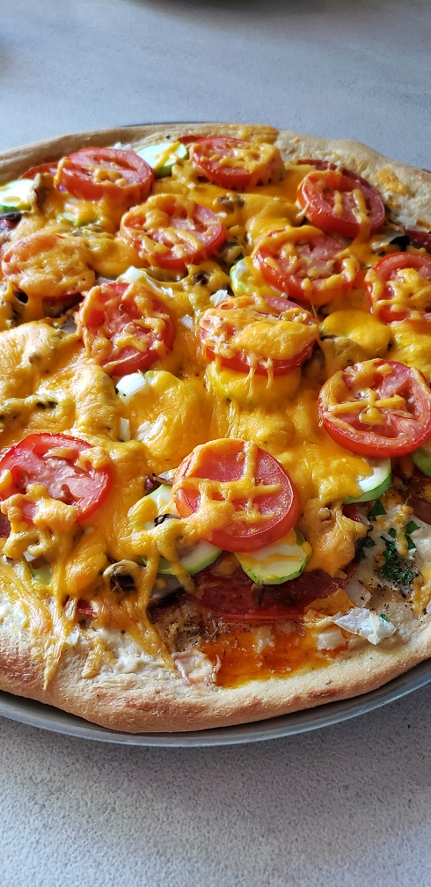

<h1> Low carb pizza dough </h1>
Makes one pizza crust standard 16-18 inches. 

2 pound loaf bread machine used

***(Note:)** Star notes some refinement still in process

**List of ingredients:**
- [ ] 3/4 cup warm water
- [ ] 2 eggs lightly beaten.
- [ ] * **1/3 cup Coccnut flour**
- [ ] * **1/2 sesamed flour**
- [ ] * **3/4 cup vital wheet gluten**
- [ ] One tsp of salt.
- [ ] 2 and1/2 tablespoons of sweetener monkfruit
- [ ] One tsp of honey.
- [ ] Half a teaspoon of as xanthan gum.
- [ ] * **2 tbsp olive oil**   
- [ ] 1 tbsp of active dry yeast 

**Directions**
1. Set the bread machine to dough.
2. Start by adding ingredients above in the order above to the bread machine pan. When you get to the active yeast create a hole in the flour to protect it from liquids. This should look like a mini volcano.
3. Once ingreedients are added to bread machine start machine.
4. Preheat oven to 350 when bread machine completes.
5. Add dough to stilo(or nonstick) pad for rolling. I found it best to use two pads one on top and one on bottome with a rolling pin.  Parchment paper might be used for bottom.
6. Roll to desired thinkness and size. 
7. Add parchment paper to cooking pan or stone. Then add dough.
8. Add toppings or pre-cook **(see Tips)**.
9. For thick Pizzas Cook 350 for 33 min turn pan 180 degrees then another ~15 min or till bubbling in middle. Thin Pizza Cook for at 425 12-18 min.

**Tips:**
- The exact amount of monkfruit is a personal preference. Not enough you will know it. 
- Due to varaions of ingreedients it is sometimes best to cook the pizza dough 5-10 minutes before adding ingreedients. Just until it has a slight crust. This will allow for a more crisp bread in the middle.
- Depending on if you cook the pizza dough before adding ingreedients and the overall thickness of the dough I generally recomend lower tempatures if thicker. example 325 at 35/40 minutes.

<h3>Possible toppings:**</h3>

**Toppings Italian:**
- Dry salami
- Pepperoni
- Italian sausage - browned
- Tomato sauce with pepper and garlic  and italian season
- Onions
- Cilantro
- Parsley
- Mozzarella
- Zucchini
- Mushrooms
- Fresh garlic

**Toppings: BBQ**
- Red onion
- BBQ Sauce
- Mozzarella smoked gouda or cheese blend
- Pepperoni 
- Cilantro
- Pepperoncini 

http://https://github.com/jstarbeam/Keto-recipes
